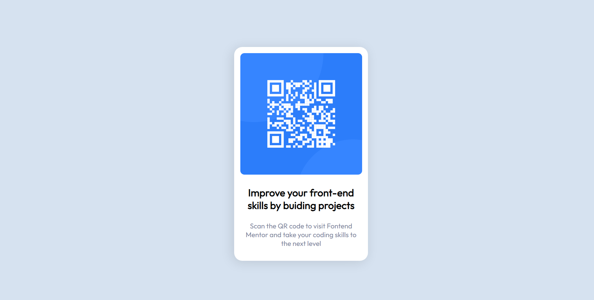

# Frontend Mentor - QR code component solution

This is a solution to the QR code component challenge on Frontend Mentor (https://www.frontendmentor.io/challenges/qr-code-component-iux_sIO_H). Frontend Mentor challenges help you improve your coding skills by building realistic projects.

## Table of contents

- [Overview](#overview)
  - [Screenshot](#screenshot)
  - [Links](#links)
- [My process](#my-process)
  - [Built with](#built-with)
  - [What I learned](#what-i-learned)
  - [Continued development](#continued-development)
- [Author](#author)

## Overview

### Screenshot



### Links

- Solution URL: https://github.com/NguyenVanKhoa-CDTH19PMC/qr-code-component
- Live Site URL: https://nguyenvankhoa-cdth19pmc.github.io/qr-code-component/

## My process

### Built with

- Semantic HTML5 markup
- CSS custom properties
- Mobile-first workflow

### What I learned

- Center Vertically and Horizontally - Using Flexbox

```css
body {
  display: flex;
  justify-content: center;
  align-items: center;
}
```

### Continued development

Improve HTML, CSS and JavaScript skills

## Author

- Frontend Mentor - @NguyenVanKhoa-CDTH19PMC (https://www.frontendmentor.io/profile/NguyenVanKhoa-CDTH19PMC)
- Github - NguyenVanKhoa-CDTH19PMC (https://github.com/NguyenVanKhoa-CDTH19PMC)
